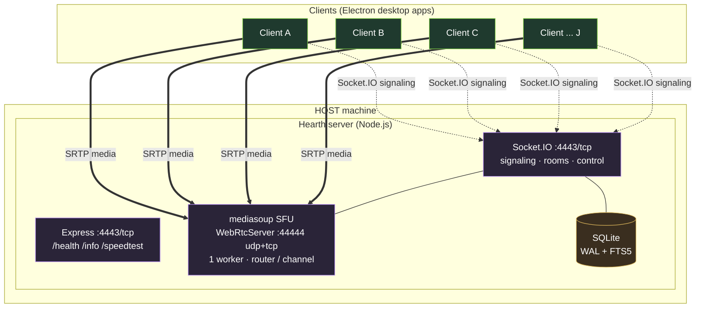
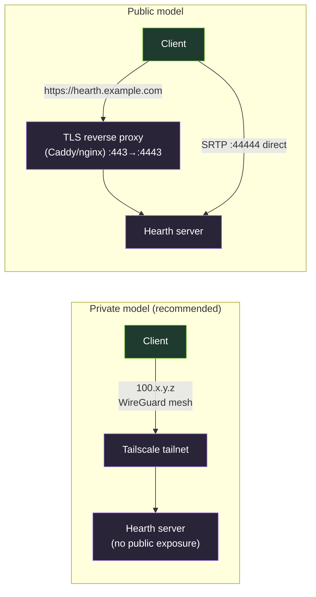
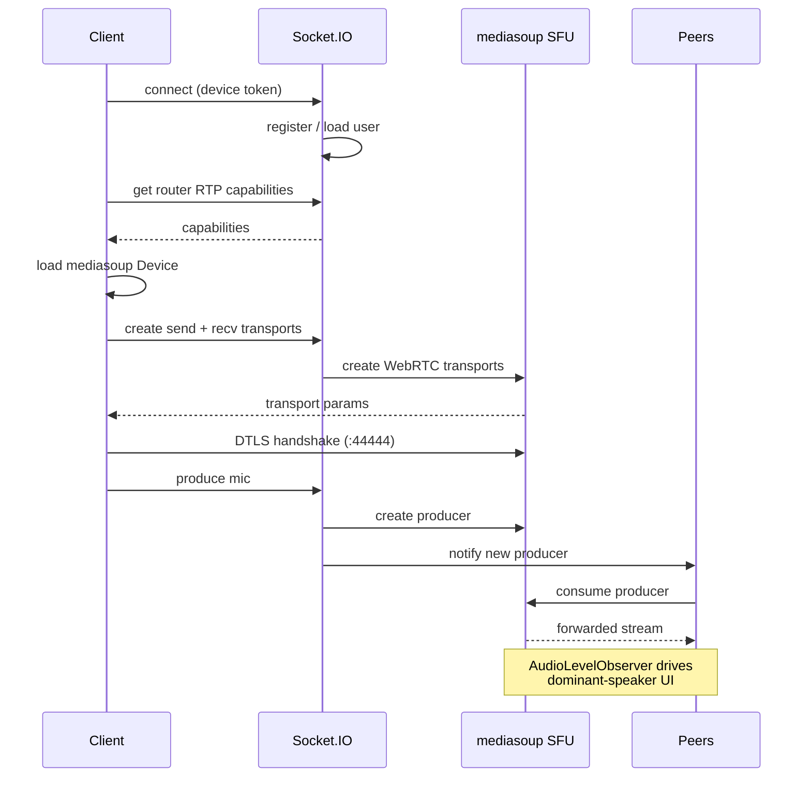
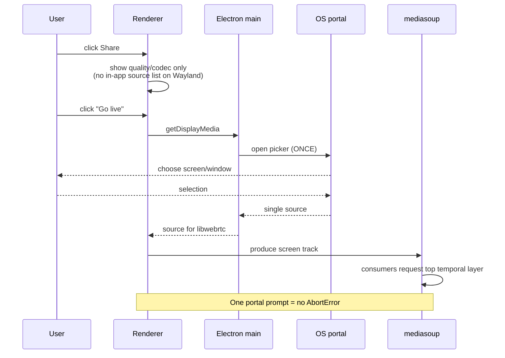
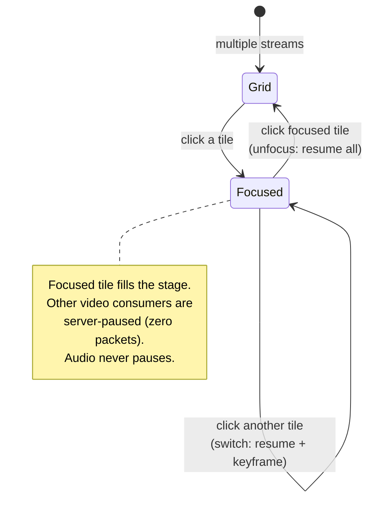
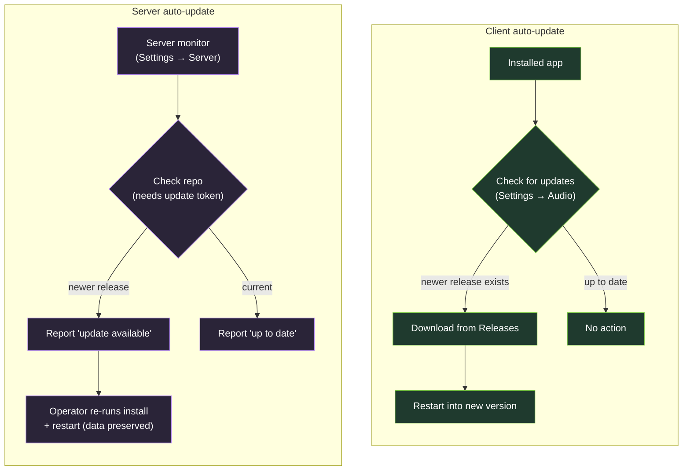
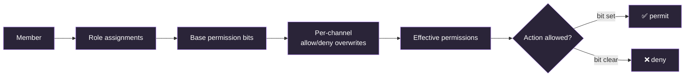
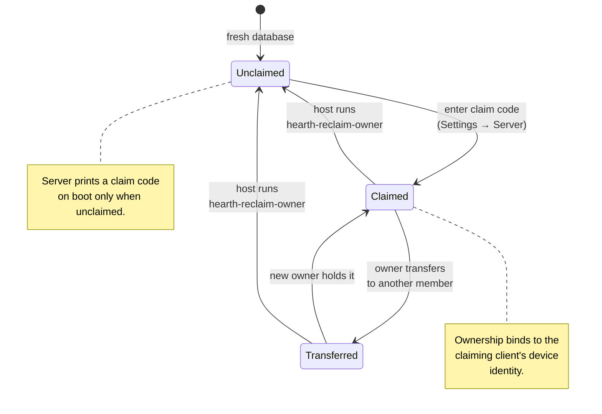
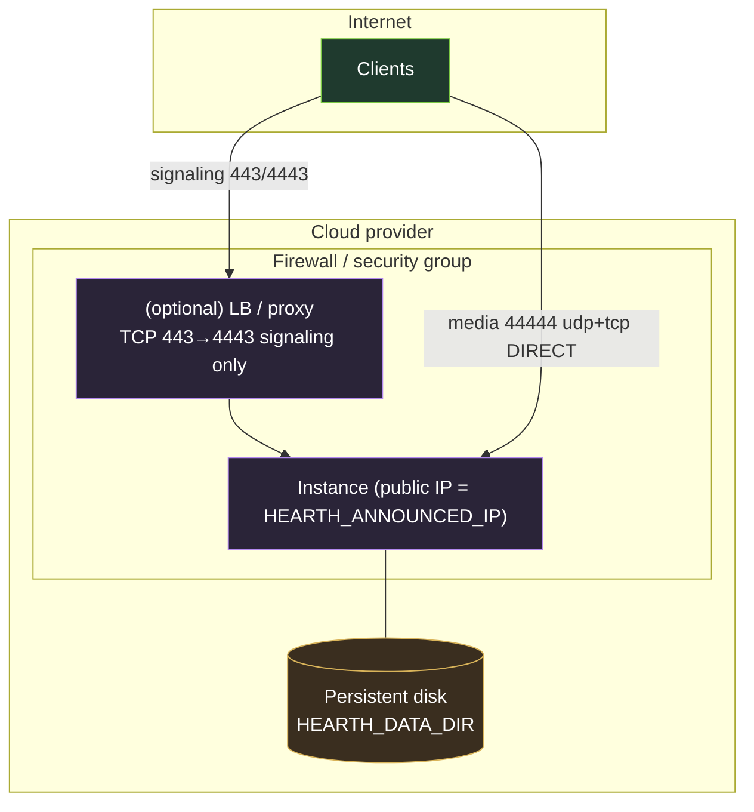
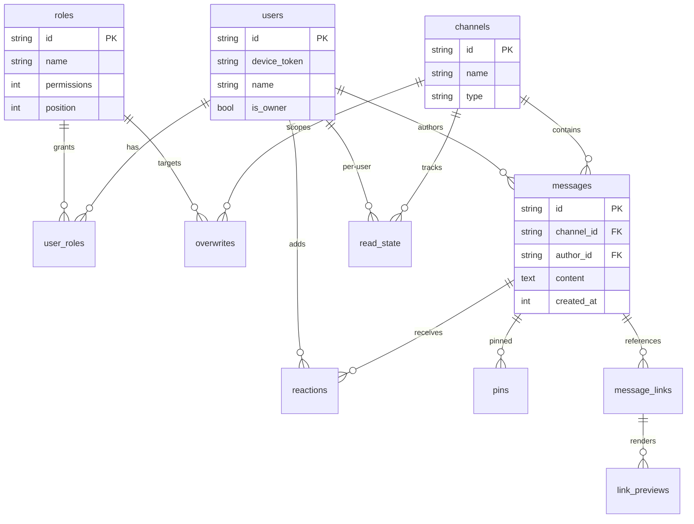

# Hearth — Diagrams

> **Audience:** all technical audiences · **Prerequisites:** none · **Time:** visual reference · **Applies to:** v0.6.x

Visual reference for Hearth's architecture and key flows. These use
[Mermaid](https://mermaid.js.org/), which GitHub renders natively in Markdown.
For the authoritative ASCII topology and prose, see
[`../ARCHITECTURE.md`](../ARCHITECTURE.md); this document is the visual
companion.

---

## 1. System architecture (SFU topology)

Every participant uploads each stream **once**; the SFU forwards copies to
everyone else. Host **upload** is the shared ceiling.

---

## 2. Network connectivity models

In the private model nothing is exposed publicly. In the public model, TLS
fronts **signaling only** — media (44444) goes direct to the instance.

---

## 3. Joining a voice channel (sequence)

---

## 4. Screen share on Wayland (single-portal flow)

---

## 5. Focus mode (watch one stream)

---

## 6. Auto-update flow (client & server)

---

## 7. Permission resolution

Permissions are a bitfield (VIEW_CHANNEL … MANAGE_EMOJIS). Note the deliberate
split of `CREATE_CHANNELS` from `MANAGE_CHANNELS`: everyone creates, Admins
delete.

---

## 8. Ownership lifecycle

The host can **always** recover ownership from the machine, regardless of
client state — the escape hatch for a stranded owner.

---

## 9. Deployment topology (cloud, single instance)

**Critical:** media (44444) bypasses the load balancer and goes direct to the
instance; only signaling is proxied. `HEARTH_ANNOUNCED_IP` must be the public
IP.

---

## 10. Data model (core tables)

Simplified — see [`../engineering/ENGINEERING_GUIDE.md`](../engineering/ENGINEERING_GUIDE.md)
§3.4 for the full table list. Chat lives in SQLite (WAL + FTS5) and prunes
oldest-first at the storage cap.
